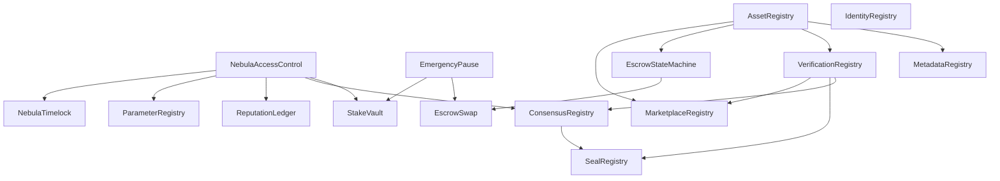

# Dependency Audit Report — Smart Contract V1.0

## Executive Summary
This document maps and verifies all contract dependencies, architectural boundaries, privilege scoping, and inheritance trees across the NebulaVerse Smart Contract Suite.

---

## 1. Dependency Graph

---

## 2. Dependency Verification Summary

| Contract | Direct Dependencies | Purpose | Circular Reference? |
| :--- | :--- | :--- | :--- |
| `NebulaAccessControl` | OpenZeppelin `AccessControl` | Root authorization layer | **No** |
| `IdentityRegistry` | None | Wallet identity registration | **No** |
| `AssetRegistry` | None | Immutable asset ownership & lineage | **No** |
| `MetadataRegistry` | `AssetRegistry` | Off-chain CID asset metadata mapping | **No** |
| `VerificationRegistry`| `AssetRegistry` | Verification lifecycle tracking | **No** |
| `ConsensusRegistry` | `NebulaAccessControl` | Validator voting ledger | **No** |
| `SealRegistry` | `VerificationRegistry`, `ConsensusRegistry` | Consensus proof seal issuance | **No** |
| `EscrowStateMachine` | `AssetRegistry` | Deterministic escrow state transitions | **No** |
| `EscrowSwap` | `EscrowStateMachine`, `EmergencyPause` | Currency-agnostic secret reveal swap | **No** |
| `MarketplaceRegistry` | `AssetRegistry`, `VerificationRegistry` | Decentralized asset listing layer | **No** |
| `StakeVault` | `NebulaAccessControl`, `EmergencyPause` | Collateral custody vault | **No** |
| `ReputationLedger` | `NebulaAccessControl` | Append-only validator event counters | **No** |
| `ParameterRegistry` | `NebulaAccessControl` | Centralized protocol configuration | **No** |
| `EmergencyPause` | OpenZeppelin `Pausable`, `Ownable` | Protocol circuit breaker | **No** |
| `NebulaTimelock` | `NebulaAccessControl` | Delayed execution governance timelock | **No** |

---

## 3. Architectural Design Principles
1. **No Circular Dependencies**: Verified complete acyclic DAG layout.
2. **Least Privilege**: Contracts only access necessary interfaces (e.g. `EscrowSwap` can only invoke `EscrowStateMachine` state transitions; `StakeVault` only queries `NebulaAccessControl`).
3. **Single Responsibility**: Storage of identity, metadata, assets, verifications, seals, escrows, listings, stakes, and reputation are completely decoupled.
