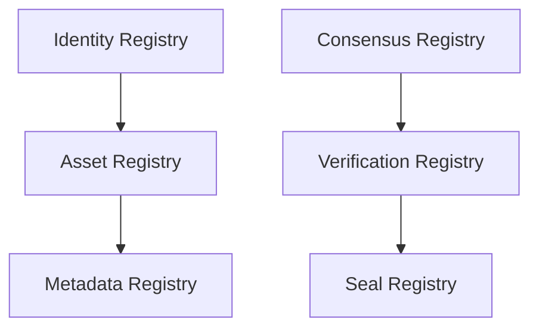

# Phase 1: Protocol Design - NebulaVerse Trust Layer

This document outlines the protocol architecture, actors, trust relationships, and registry components designed for Phase 1.

## 1. System Actors & Roles

- **Platform Admin (Owner/Multisig)**: Manages core system configurations, role assignments, and emergencies.
- **Validators**: Nodes or entities staking collateral to vote on state updates, identity verifications, and disputes.
- **Users (Buyers & Sellers)**: Interface with the trust layer to exchange assets and execute escrows.
- **Verifiers**: Third-party entities authorized to issue cryptographic seals or verification credentials.

---

## 2. Core Registries & Trust Flow

- **Identity Registry**: Maps addresses to decentralized identities (DIDs) or verifiable credentials, including validator statuses.
- **Asset Registry**: Manages references to real-world or digital assets linked to unique identity records.
- **Metadata Registry**: Houses schema references and hashes of off-chain metadata (IPFS/Arweave).
- **Verification Registry**: Records validation results provided by verifiers and consensus outcomes.
- **Seal Registry**: Tracks cryptographic seals applied to assets or identities to prove verification integrity.
- **Consensus Registry**: Handles validator consensus state for on-chain voting and reputation outcomes.
